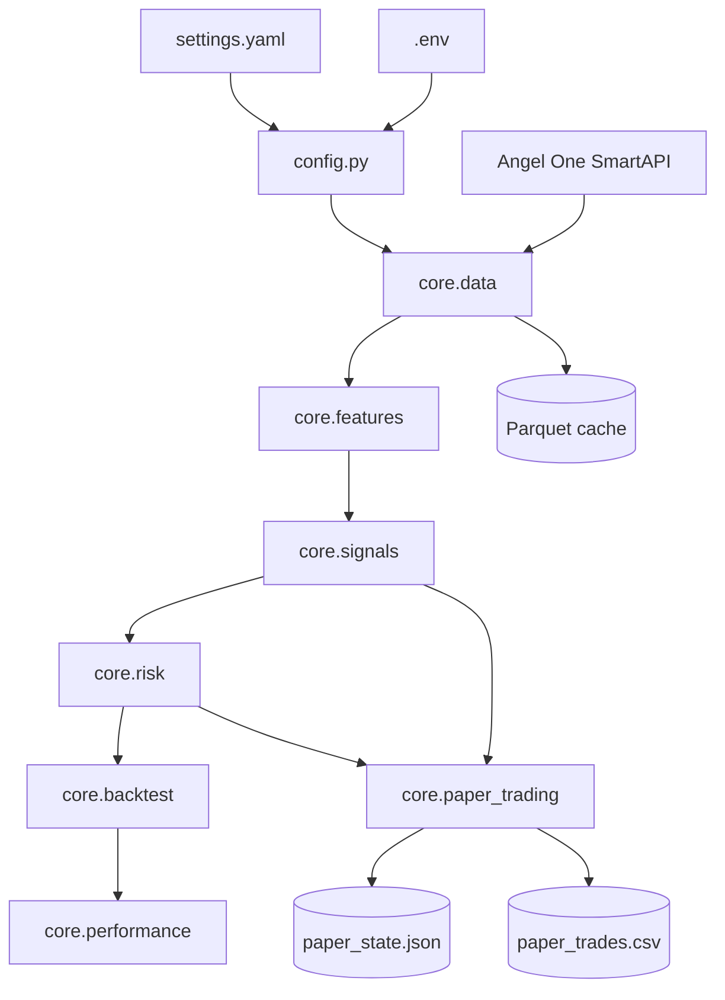
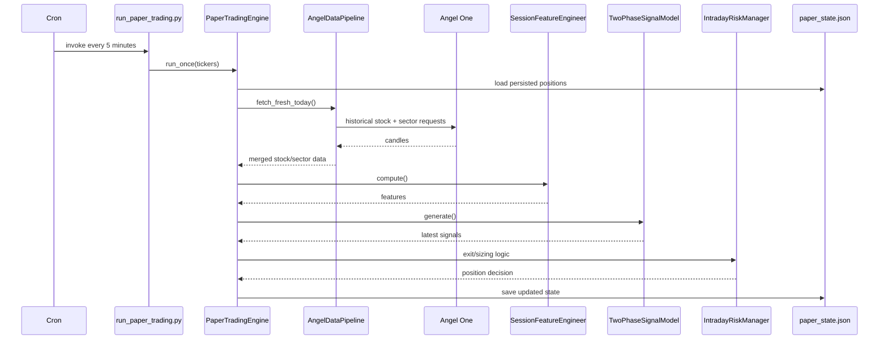

# Architecture — Actual Repository Implementation

> This document describes the architecture visible in the repository. `docs.txt` remains the v1.4 target architecture; where code and target differ, this document records the implementation rather than assuming the target is already built.

## 1. System architecture

The repository is a flat Python application with a `core/` package and root orchestration scripts. There is no web server, frontend, database, message broker, or background worker framework.



## 2. Configuration architecture

`config.py` is the single configuration import surface used by root scripts:

```python
from config import CREDENTIALS, SETTINGS
```

`CREDENTIALS` comes from `.env`. `SETTINGS` is a `Settings` dataclass populated by flattening nested sections of `settings.yaml`. The dataclass still has built-in defaults, despite the YAML comments describing a “nothing hardcoded” design. Missing YAML fields therefore silently use defaults.

`settings.yaml` currently configures data cache/history/interval, opening-range length, signal thresholds, risk/cost parameters and five instruments.

## 3. Data architecture — `core/data.py`

### `InstrumentConfig`

Represents one instrument and its sector mapping. It includes ticker, Angel token, exchange, sector index/token/exchange, gap threshold and display name. Five class constructors exist: `HDFCBANK()`, `ICICIBANK()`, `RELIANCE()`, `INFY()`, `TCS()`.

### Sector proxy resolution

`get_active_futures_token()` reads Angel One's ScripMaster and selects the nearest non-expired `NFO` `FUTIDX` whose `name` exactly matches the requested sector index. It caches the selected contract in `data_cache/sector_tokens.json`. `_fetch_scrip_master()` caches the daily ScripMaster JSON in `data_cache/scrip_master.json` and also uses an in-process `lru_cache(maxsize=1)`.

This means the actual implemented sector feed is a futures proxy, not direct NSE index candles.

### Authentication

`AngelAuthenticator` creates a TOTP with PyOTP and logs into Angel One's `loginByPassword` endpoint. The JWT is kept in process memory. `get_auth_headers()` logs in when no token exists or when the token is older than 23 hours.

### Historical fetching

`HistoricalDataFetcher.fetch_candles()` calls Angel One's historical candle endpoint with `FIVE_MINUTE` data. It retries HTTP 403/429 and request exceptions with exponential waits. A non-success JSON response with HTTP 200 currently returns `None` rather than being retried.

`fetch_full_history()` splits requests into 30-calendar-day chunks and rejects partial history by raising if a chunk fails.

### Timestamp normalization

`_to_dataframe()` parses provider timestamps as UTC, converts them to `Asia/Kolkata`, then adds five minutes so timestamps represent bar close. Data is sorted and duplicate timestamps are removed, keeping the last row.

### Data quality

`MissingBarDetector` expects 75 five-minute bars per full NSE session and marks a session only when actual bars are below 90% of expected. It does not currently implement the architecture's explicit forward-fill/skip-session policy.

`DataValidator` checks OHLCV NaNs, high/low ordering, non-positive volume and session-hour bounds.

### RVOL

`RVOLCalculator` uses only prior sessions, capped by `lookback_sessions`, and leaves the first three sessions without RVOL. `AngelDataPipeline.WARMUP_CALENDAR_DAYS = 30` extends the fetch before RVOL computation and trims it back afterward so requested windows have prior-session context.

### Cache

`LocalCache` stores Parquet files under `data_cache`. `exists()` uses an age threshold. `fetch_fresh_today()` deliberately checks physical cache existence and then merges a cached historical baseline with a fresh recent API slice, recomputing gaps and RVOL on the merged data. This separate live-data path exists because a long historical-cache TTL is inappropriate for intraday paper trading.

## 4. Feature architecture — `core/features.py`

`SessionFeatureEngineer.compute()` executes these stages in order:

1. `_add_session_metadata()` — session date, zero-based bar index, phase.
2. `_add_atr()` — daily OHLC resampling and Wilder-style EWM; previous-day ATR is mapped to intraday bars.
3. `_add_opening_range()` — OR high/low/range/mid.
4. `_add_intraday_vwap()` — cumulative session VWAP.
5. `_add_gap_features()` — previous close/current first open gap and `WIDE`/`FLAT` label.
6. `_add_prev_day_high()`.
7. `_add_price_features()` — close position and distances.
8. `_add_sector_features()` — sector close, sector VWAP, sector-above-VWAP and consecutive below-VWAP count.
9. `_validate()` — feature sanity report.

The configured OR length is passed from `SETTINGS.or_end_bar`; current YAML value is 3 bars.

## 5. Signal architecture — `core/signals.py`

`TwoPhaseSignalModel` processes each session sequentially using `_SessionState`.

State includes:

- `phase_a_bar_idx`
- `phase_a_close`
- `highest_high`
- `bars_since_a`
- `signal_fired`
- `phase_a_seen`
- `awaiting_fill`
- pending score/depth

Phase A currently checks a long breakout buffer, RVOL and candle close position. After Phase A, the engine updates the running high, checks invalidations, requires a pullback low touch, scores S1–S6 and queues a fill. The fill is recorded on the next bar's open.

The implementation outputs only `LONG` signals. The module documentation says model version `1.3` while describing several v1.4 fixes.

## 6. Risk architecture — `core/risk.py`

`IntradayRiskManager.size_trade()` calculates long stop/target, minimum gross move, risk-based quantity, notional cap and a tradeability result.

`simulate_trade()` walks bars after entry and calls `_check_bar_exit()` for stop, target, trailing stop and 15:15 square-off. Same-bar ambiguity is intentionally conservative: trail update, then stop, then target.

`DailyRiskTracker` tracks realized daily P&L and exposes `can_trade()`/`limit_hit`.

## 7. Backtest architecture — `core/backtest.py`

`IntradayBacktestEngine.run()`:

- loops through requested tickers;
- obtains stock/sector data;
- computes features;
- generates signals;
- collects LONG signals;
- sorts them chronologically across instruments;
- resets one `DailyRiskTracker` at each date;
- sizes and simulates trade candidates;
- permits simultaneous positions across different instruments.

`BacktestReport` computes total trades, P&L, win rate, profit factor, exit counts, per-instrument statistics, equity curve and maximum drawdown.

## 8. Performance architecture — `core/performance.py`

`PerformanceAnalyzer` consumes a `BacktestReport` and calculates statistical and diagnostic metrics. Its Phase-1 verdict uses a 30-trade minimum, an 80-trade target and a 58% target win rate.

The implemented report does not cover every diagnostic named in v1.4.

## 9. Paper-trading architecture — `core/paper_trading.py`

Paper trading is a short-lived process invoked repeatedly by cron. `PaperTradingState` persists open positions and per-instrument last-checked dates.

For each instrument, `PaperTradingEngine`:

1. fetches cached history + fresh data;
2. computes features/signals;
3. checks an existing position against the latest bar using the same risk exit helper as backtesting;
4. otherwise checks whether a new LONG signal appeared and has not already been acted on;
5. persists state.

There is no real order-placement integration in the paper engine.

## 10. API architecture

The only implemented external API is Angel One SmartAPI. There are two relevant API interactions:

- authentication/login;
- historical candle retrieval.

No internal HTTP API exists.

## 11. Database/storage architecture

There is no relational or document database. Local persistence is:

- `data_cache/*.parquet` — market-data cache;
- `data_cache/scrip_master.json` — daily Angel ScripMaster cache;
- `data_cache/sector_tokens.json` — daily sector-contract selections;
- `paper_state.json` — paper position state;
- `paper_trades.csv` — completed paper-trade log.

These runtime artifacts are not part of the normal committed source tree; `data_cache/` and credential files are ignored by Git.

## 12. Frontend/UI

**UNKNOWN — not present.** The repository contains no frontend framework or UI source.

## 13. Background scheduling

There is no application scheduler library. `run_paper_trading.py` is designed for OS-level cron. The cron expression documented in that file runs every five minutes on weekdays during the 09:00–15:59 window; the Python engine itself rejects times outside 09:15–15:30.

## 14. Deployment architecture

The repository contains no deployment manifests, Dockerfile, CI workflow, systemd service or infrastructure-as-code. Production/paper deployment details are therefore **UNKNOWN from repository files**. The paper script explicitly assumes a `.venv` and a filesystem path in cron documentation.

## 15. Fragile/tightly coupled areas

- `run_*.py` scripts directly construct all core objects rather than using a composition/configuration factory.
- `Settings` has defaults that can silently diverge from YAML.
- Sector futures resolution depends on Angel ScripMaster names and current contracts.
- Paper trading directly shares the private `_check_bar_exit()` method with risk simulation; this intentionally prevents exit-logic drift but couples modules.
- Paper state is a local JSON file with no locking/transaction mechanism.
- Historical fetching is tightly coupled to Angel's HTTP API inside `core/data.py`; the abstract multi-provider architecture described in `docs.txt` is not represented by an actual interface hierarchy.
- Root validation scripts contain hardcoded subsets of instruments.
- Signal/risk logic is long-only despite the architecture specifying a short mirror.

## 16. Architecture sequence


