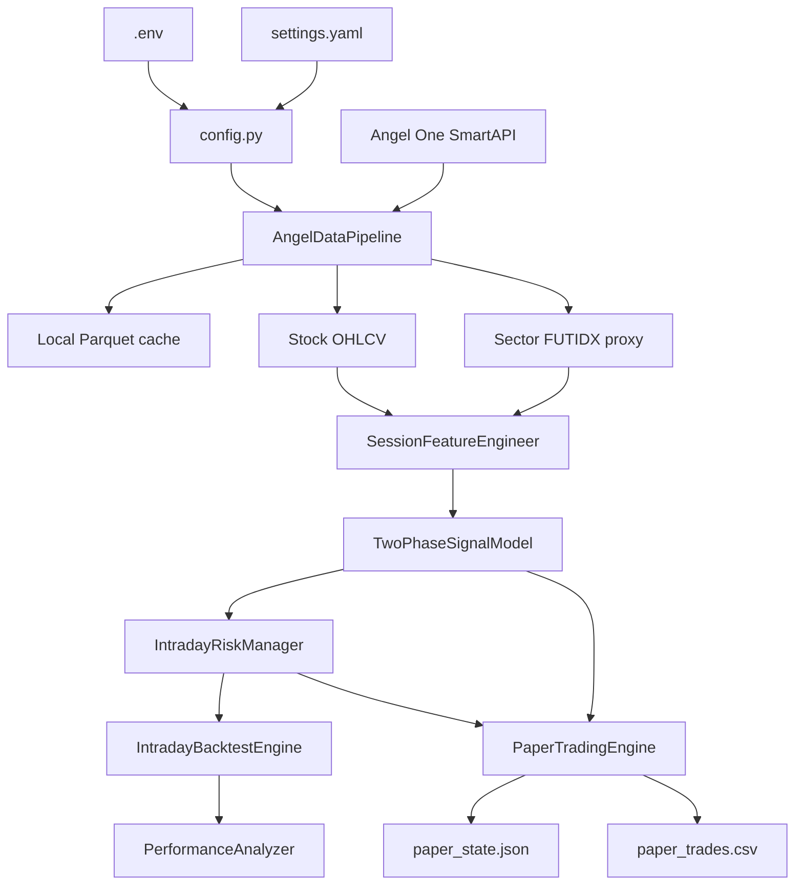

# Adaptive Algorithmic Trading System — Project Context

> Repository-derived context snapshot. Updated from `master` at commit `9e796a605e35691f44339a385284f72f4a2105a4`.

## 1. What this project is

This is a Python quantitative-trading system whose implemented workstream is an intraday NSE cash-equity Opening Range Breakout (ORB) strategy. The strategy uses 5-minute OHLCV data, session-level features, a two-phase breakout/pullback signal model, ATR-based risk management, multi-instrument backtesting, performance analysis, and cron-driven paper trading.

The committed architecture document in `docs.txt` defines a broader v1.4 target architecture. The codebase does not yet implement every v1.4 requirement. This context deliberately distinguishes the target architecture from the actual implementation.

## 2. Business/domain purpose

The v1.4 design is intended to validate an intraday trading algorithm at low financial risk before live scaling. The validation capital is ₹1,00,000; the architecture explicitly describes this as validation capital rather than a return-generation objective. The intended progression is Phase 0 paper trading, Phase 1 live validation with 80+ trades, and Phase 2 scaling only after live metrics are validated.

The strategy is intended to:

- detect strong directional momentum after the opening session establishes a range;
- require a confirmed pullback rather than enter every raw breakout;
- manage risk with explicit stop, target, trailing and daily-loss rules;
- close positions intraday and never hold overnight;
- produce a statistically defensible trade record for validation.

## 3. Main actors

- **Strategy operator/developer:** runs validation scripts, backtests, paper trading and eventually live trading.
- **Angel One SmartAPI:** implemented external broker/data service.
- **Market/data provider:** currently Angel One historical candle API; the v1.4 architecture names additional future data-source abstractions but they are not implemented here.

There is no end-user web application, user database, or application-level role/permission system in this repository.

## 4. Instruments

`settings.yaml` configures:

- `HDFCBANK`
- `ICICIBANK`
- `RELIANCE`
- `INFY`
- `TCS`

`core/data.py` provides explicit `InstrumentConfig` builders for all five. HDFCBANK and ICICIBANK map to BANKNIFTY; RELIANCE maps to NIFTY; INFY and TCS map to NIFTYIT. Sector proxies are resolved to active NFO `FUTIDX` contracts when a token is not supplied.

`run_paper_trading.py` currently hardcodes only `HDFCBANK`, `ICICIBANK`, and `RELIANCE`, because its own comment says INFY/TCS sector proxy handling is not yet treated as confirmed.

## 5. Core workflow



### Backtest workflow

Root orchestration (`run_backtest.py`) constructs the pipeline, feature engineer, signal model and risk manager from `CREDENTIALS`/`SETTINGS`, then calls `IntradayBacktestEngine.run(SETTINGS.instruments)`. The engine processes each instrument through data → features → signals, collects LONG signals, merges them chronologically, and applies a shared daily P&L tracker.

### Paper workflow

`run_paper_trading.py` creates the same core components and invokes `PaperTradingEngine.run_once()` for its currently selected three instruments. Each invocation is intentionally short-lived. `PaperTradingEngine` loads `paper_state.json`, obtains cached historical data plus a fresh recent slice, evaluates open positions first, then checks for a new LONG signal, and persists state. Closed trades are appended to `paper_trades.csv`.

## 6. Important terminology

- **OR / Opening Range:** first 15 minutes, represented by 3 five-minute bars in the configured implementation.
- **OR_H / OR_L:** opening-range high/low.
- **Phase A:** breakout setup state. The implemented model detects a long setup when price closes sufficiently above OR_H with RVOL and candle-quality confirmation.
- **Phase B:** pullback candidate after Phase A. Candidate bars are scored S1–S6; a qualifying decision is intended to fill at the next bar open.
- **I1–I5:** Phase-A invalidation concepts in v1.4. Code implements I1/I1b/I2/I3/I4; I5 is described in code as external risk-manager handling but is not implemented as a signal-model check.
- **S1–S6:** Phase-B score components.
- **RVOL_ToD:** time-of-day relative volume calculated from prior sessions only.
- **Sector proxy:** active NFO `FUTIDX` contract selected from Angel One ScripMaster.
- **bar-close timestamps:** provider timestamps are converted to IST and shifted five minutes so strategy timestamps represent bar close.
- **Phase 0:** paper-trading validation.
- **Phase 1:** ₹1L live validation after paper validation.
- **Phase 2:** capital scaling after Phase 1 validation.

## 7. Technology stack

- Python
- pandas 2.3.3
- NumPy 2.2.6
- PyArrow 25.0.0
- requests 2.34.2
- PyOTP 2.10.0
- PyYAML 6.0.3
- python-dotenv 1.2.2
- python-dateutil, pytz/tzdata
- Angel One SmartAPI over HTTPS
- Parquet for market-data caches
- JSON for paper-trading state
- CSV for completed paper trades
- Git/GitHub

Exact Python interpreter version is **UNKNOWN — not pinned in the repository**.

## 8. Repository structure

```text
.
├── .gitignore
├── check_import_paths.py
├── config.py
├── debug_reproducibility.py
├── docs.txt
├── requirements.txt
├── run_backtest.py
├── run_data.py
├── run_features.py
├── run_paper_trading.py
├── run_performance.py
├── run_risk.py
├── run_signals.py
├── settings.yaml
└── core/
    ├── __init__.py
    ├── backtest.py
    ├── data.py
    ├── features.py
    ├── paper_trading.py
    ├── performance.py
    ├── risk.py
    └── signals.py
```

There is no committed `README.md`. `docs.txt` is the principal existing architecture/strategy document.

## 9. Component map

### `config.py`
`Settings` is a flat dataclass populated from nested YAML sections. `CREDENTIALS` is populated from `.env`. Missing credential values hard-fail. Unknown YAML settings are warned about and ignored.

### `core/data.py`
Defines the complete implemented Angel One data layer: `InstrumentConfig`, ScripMaster loading, active FUTIDX resolution, `AngelAuthenticator`, `HistoricalDataFetcher`, `MissingBarDetector`, `RVOLCalculator`, `DataValidator`, `LocalCache`, and `AngelDataPipeline`.

Important pipeline APIs:

- `fetch()` — historical stock data, optionally using cache;
- `fetch_with_sector()` — historical stock + sector data;
- `fetch_fresh_today()` — cached historical baseline merged with fresh recent stock/sector data for paper trading.

### `core/features.py`
`SessionFeatureEngineer` adds session metadata, opening range, cumulative session VWAP, daily Wilder-style ATR mapped from the previous session, gap information, previous-day high, price features, sector VWAP and consecutive sector-below-VWAP counts.

### `core/signals.py`
`TwoPhaseSignalModel` maintains per-session mutable state. The current implementation is long-only and has explicit state for Phase A, highest high, bars since setup, one-signal-per-session, and pending next-bar-open fill.

### `core/risk.py`
`IntradayRiskManager` performs long-side position sizing and forward trade simulation. `DailyRiskTracker` applies a shared realized-P&L daily limit. `_check_bar_exit()` is intentionally shared by backtesting and paper trading.

### `core/backtest.py`
`IntradayBacktestEngine` runs instruments through the pipeline, collects signals, merges them chronologically, and applies a shared daily loss tracker. It permits simultaneous positions across instruments; the code explicitly calls this a modeling assumption worth revisiting.

### `core/performance.py`
`PerformanceAnalyzer` calculates Wilson confidence intervals, average win/loss, expectancy, profit factor, per-trade risk-adjusted ratios, streaks, daily P&L, exit-reason breakdown, Kelly fraction and Phase-1 verdict.

### `core/paper_trading.py`
`PaperTradingState` persists open positions and per-instrument last-checked dates. `PaperTradingEngine` evaluates open positions first and then new signals. State is written to JSON and closed trades to CSV.

## 10. Authentication and secrets

`config.py` requires these environment variables:

- `ANGEL_API_KEY`
- `ANGEL_CLIENT_ID`
- `ANGEL_MPIN`
- `ANGEL_TOTP_SECRET`

`AngelAuthenticator` generates the current TOTP with PyOTP and calls Angel One's password login endpoint. The resulting JWT is held in memory for the process. The repository does not implement a persistent application authentication system.

`.gitignore` excludes `.env`, `.env.*`, credential files and data caches. Never commit or reproduce real credentials, tokens, MPINs, TOTP secrets, or other secrets in documentation or logs.

## 11. Important constraints from the v1.4 design

The architecture requires:

- 5-minute bars;
- bar-close timestamps in IST;
- ₹1,00,000 validation capital;
- 1% maximum risk per trade;
- 2% daily loss limit;
- 25% maximum position notional;
- 0.6% minimum gross target;
- 3:15 PM IST square-off;
- no overnight positions;
- walk-forward validation with 2 years train + 6 months test and 5+ folds;
- 80+ completed out-of-sample trades before statistical validation;
- stability testing under ±20% parameter changes.

The architecture's target metrics are >58% win rate, >1.5 profit factor, >₹50 expectancy per trade after costs and >1.3:1 net average win/loss.

## 12. Current implementation state

The repository has substantial implementation for the first eight conceptual steps, including paper trading, but the implementation is not equivalent to full v1.4 compliance. In particular, calendar/event handling, regime classification, short-side symmetry, full missing-bar policy, several feature/diagnostic requirements, rolling live monitoring, walk-forward infrastructure, and live execution integration are incomplete or absent.

See `docs/CURRENT_STATUS.md` and `docs/TODO.md` for the evidence-based state and backlog.
